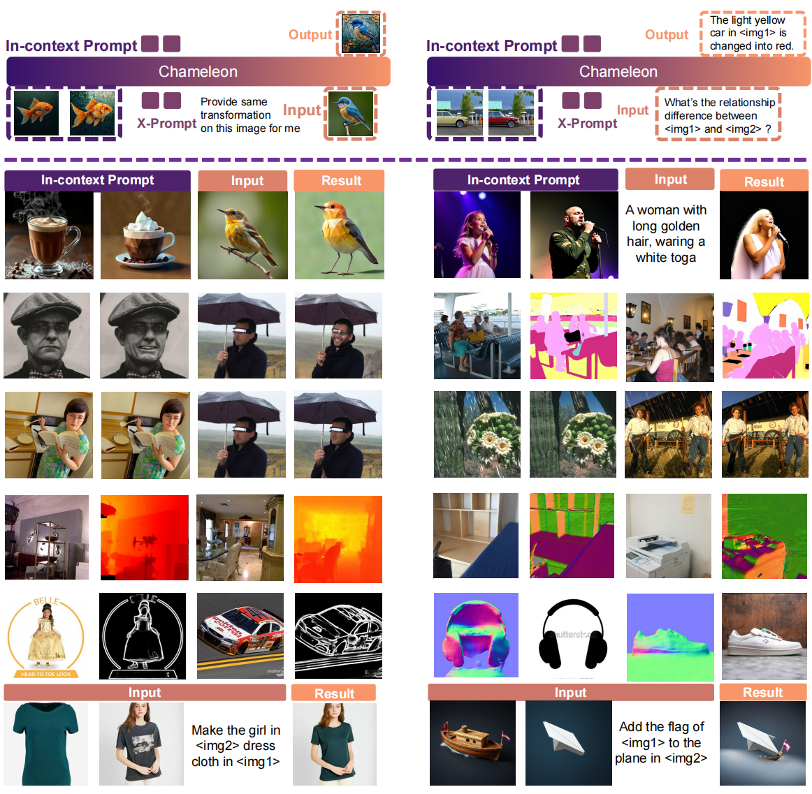

<div align="center">

# <span style="color: rgb(114, 58, 107); font-weight: bold;">X-Prompt</span>

<b> This repository is the official implementation of <span style="color: rgb(114, 58, 107); font-weight: bold;">X-Prompt</span>: Towards Universal In-Context Image Generation in Auto-Regressive Vision Language Foundation Models </b>

</div>



**[Towards Universal In-Context Image Generation in Auto-Regressive Vision Language Foundation Models](https://arxiv.org/abs/2412.01824)**
</br>
[Zeyi Sun](https://github.com/SunzeY),
[Ziyang Chu](https://github.com/Anthony77777777),
[Pan Zhang](https://panzhang0212.github.io/),
[Tong Wu](https://wutong16.github.io/),
[Yuhang Zang](https://yuhangzang.github.io/),
[Xiaoyi Dong](https://lightdxy.github.io/),
[Yuanjun Xiong](http://yjxiong.me/),
[Dahua Lin](http://dahua.site/),
[Jiaqi Wang](https://myownskyw7.github.io/)
<p align="center">
<a href="https://arxiv.org/abs/2412.01824">"></a>
</p>

🔥 We will release the code and models soon!

## 🛠️ Usage

### Installation

### Inference

## ✒️ Citation
If you find our work helpful for your research, please consider giving a star ⭐ and citation 📝
```bibtex
@misc{sun2024xpromptuniversalincontextimage,
      title={X-Prompt: Towards Universal In-Context Image Generation in Auto-Regressive Vision Language Foundation Models}, 
      author={Zeyi Sun and Ziyang Chu and Pan Zhang and Tong Wu and Xiaoyi Dong and Yuhang Zang and Yuanjun Xiong and Dahua Lin and Jiaqi Wang},
      year={2024},
      eprint={2412.01824},
      archivePrefix={arXiv},
      primaryClass={cs.CV},
      url={https://arxiv.org/abs/2412.01824}, 
}
```
